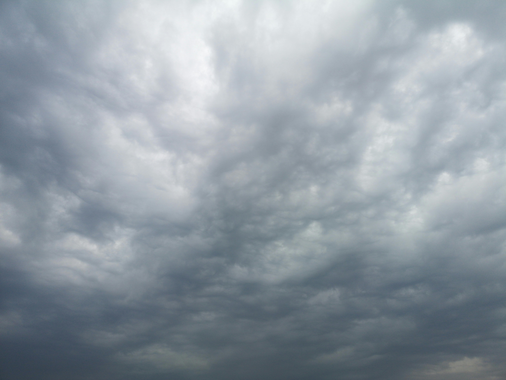

# Weather App

A React weather application that shows real-time weather data for any city in the world.

## Features
- Search weather by city name
- Displays temperature, humidity, wind speed, and feels like
- Weather icon from OpenWeatherMap
- Error handling for invalid cities
- Press Enter or click Search button

## Technologies Used
- React
- OpenWeatherMap API
- CSS

## Live Demo
[Add Vercel link here]

## Screenshot


## Getting Started

### Installation
```bash
git clone https://github.com/mamykhoulalene-star/weather-app
cd weather-app
npm install
```

### Setup
Create a `.env` file in the root directory: